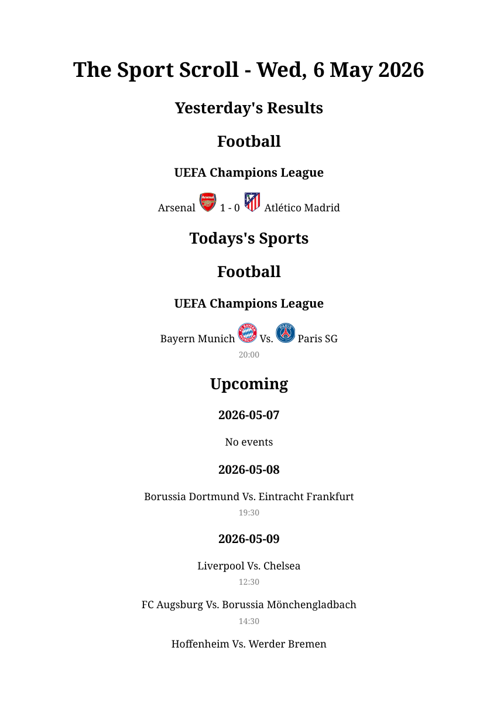

# SportScroll

A configurable PDF that generates yesterday's results, today's events, and upcoming events using "TheSportsDB" api

## Table of Contents

- [Background](#background)
- [Install](#install)
- [Project Structure](#project-structure)
- [Configuration](#configuration)
- [Usage](#usage)
- [Examples](#examples)
- [Roadmap](#roadmap)
- [Contributing](#contributing)
- [License](#license)
- [Credits / Acknowledgements](#credits--acknowledgements)


## Background

I started this project as a way to aggregate multiple different sports, leagues, and tournaments into one easy to digest PDF, and move away from my phone.

Each morning I found myself reaching for my phone and scrolling through multiple different apps and websites to get sports results. With less popular sports it can be hard to find useful information, and events could easily be missed. The aim of this project is to produce one single document (printed or on screen) that contains all the information for the sports and leagues you follow, without scrolling on your phone.

## Install

1. Clone the Repo
2. Install Python (3.14.3)
3. Install WeasyPrint system dependencies — [see installation guide](https://doc.courtbouillon.org/weasyprint/stable/first_steps.html)
4. `pip install -r requirements.txt`

## Project Structure

```
sportscroll/
├── main.py              — entry point
├── config.yaml          — user configuration
├── requirements.txt
├── assets/
│   ├── example_output.png
│   └── example_output.pdf
└── src/
    ├── api.py           — TheSportsDB API client
    ├── cache.py         — cache read/write/validation
    ├── config.py        — config loader
    ├── data.py          — data fetching and orchestration
    └── pdf.py           — HTML generation and PDF rendering
```

## Configuration

All configuration is in `config.yaml` in the project root.

| Key | Description | Default |
|-----|-------------|---------|
| `timezone` | Your local timezone (tz database format e.g. `Europe/London`) | `Europe/London` |
| `tv_region` | Country name for TV channel lookup | `United Kingdom` |
| `cache_ttl_mins` | How long cached data is considered fresh (in minutes) | `60` |
| `premium` | Set to `true` if you have a TheSportsDB premium key | `false` |
| `key` | Your TheSportsDB API key — `123` is the public free key | `123` |
| `tv_lookup` | Enable TV channel lookup | `false` |

To enable or disable a sport, set `enabled: true` or `enabled: false` under the relevant league in the `sports` section.

## Usage

1. edit `config.yaml` to your preferences and timezone
2. run `main.py`

## Examples




## Roadmap

These are not currently ordered and more reflects features and ideas I've had and will likely be adding as the project continues

- Wire up `main.py` as the proper entry point
- Multi Sport Support
- Integrate TV channel lookup into the PDF output
- Improve formatting for PDF to make it `pretty`
- Add cache cleanup so old `.json` files don't accumulate in `.cache/`
- Add favourite teams config and highlighting in the PDF
- Add venue name and country flag to event display
    - Potential to Add weather display
- Add event importance tiers per sport (e.g. F1 Race is higher importance, Practice lower importance)
- Add sport-specific layouts (league tables, championship standings)
    - Add league tables on a configured day of the week only
- Add logging
- Add CLI menu for configuration without editing config.yaml
- Add cron job support with auto-print option each morning


## Contributing

This is a personal learning project. However, feedback and bug reports are welcome and encouraged.


## License

MIT License © George Cliff

## Credits / Acknowledgements

- [TheSportsDB](https://www.thesportsdb.com/) — a big thank you to them for the sports data API that makes this whole project possible
